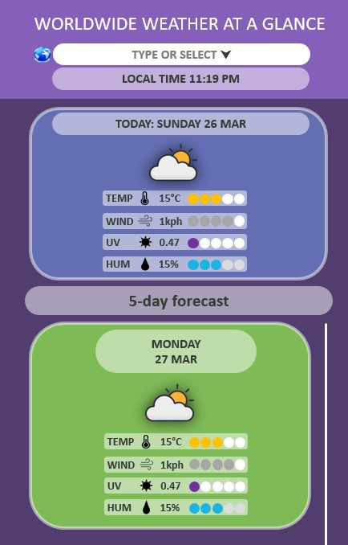
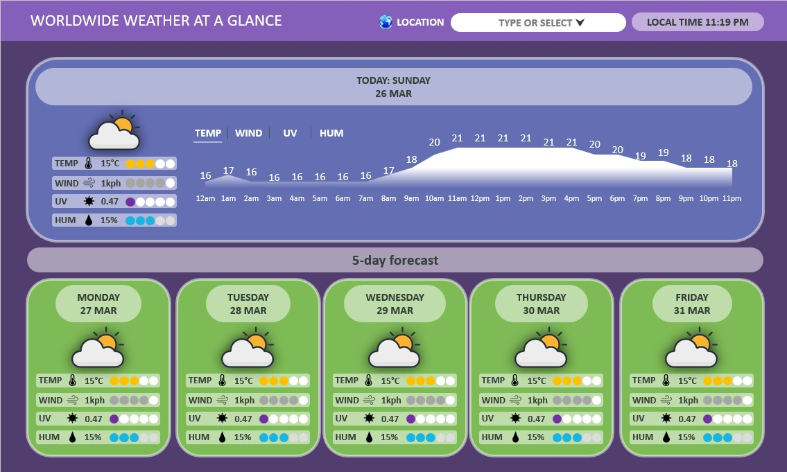

# Weather Dashboard

  

## Introduction

This easy-to-use dashboard allows the user to search for any city they want and get instant results for temperature, wind speed, UV index and humidity. This app solves the problem of getting useful information quickly about any city. I made this app to learn about Server-side APIs, and I used OpenWeather API in this project to search their database with the queried city.

## Usage

Deployed: [Worldwide Weather At A Glance](https://leoelicos.github.io/bcs-06-weather-dashboard/). Will run on a browser.

## Screenshots

### Mobile devices

### Large screens

## Credits

-  BCS Resources
-  normalize.css v8.0.1 | MIT License | github.com/necolas/normalize.css

## License

&copy; Leo Wong <leoelicos@gmail.com>

Licensed under the [MIT License](./LICENSE).
